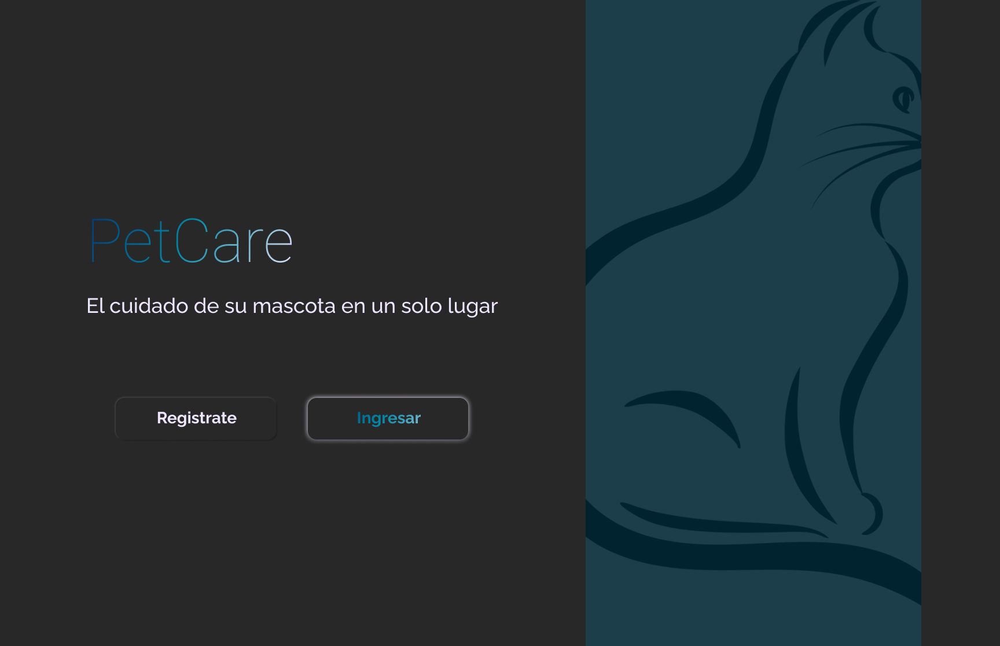

## Table of Contents

1. [General Info](#general-info)
2. [Technologies](#technologies)
3. [Installation](#installation)
4. [Collaboration](#collaboration)
5. [FAQs](#faqs)

<hr>

## General Info

University project - Politecnico gran colombiano
<b>Current status:</b> in progress...

<hr>

## Screenshot



## Technologies

- [react](https://es.reactjs.org/): version 18.2.0
  
## libraries

- [commitizen](https://github.com/commitizen/cz-cli): version 4.2.5
- [esLint](https://eslint.org/): version 8.24.0
- [prettier](https://prettier.io/): version 2.7.1


<hr>

## Installation

yarn install
yarn start
<hr>


Create an `./App` folder for the project, navigate to it and run: (You can use yarn or npm)

```
$ git clone https://github.com/BNAStudio/PetCare_App
$ cd ./PetCare_App
$ yarn install
$ yarn run dev
```
<hr>

### Side information:

To handle dependencies you can use `yarn` or `npm`
<hr>

## Collaborators

- Daniel M.
<hr>

# Instructions on how to collaborate with the project:

## Instructions to get started:

1. Fork the repository and clone it on your local machine.
2. Install project dependencies using the command `yarn install`.
3. To run the eslint linter, use the command `yarn lint`.
4. To format code using prettier, use the command `yarn format`.
5. Make sure to run the yarn cz command after running `git add` to run the commit generator.
6. Remember, to compile the project in <b>development mode</b>, use the command `yarn start`.

<i>Please note that the commit messages should follow the **[Conventional Commits](https://www.conventionalcommits.org/en/v1.0.0/)** standard.</i>
<hr>

## Instrucciones para empezar:

1. Realice un fork del repositorio y clónelo en su máquina local.
2. Instale las dependencias del proyecto utilizando el comando `yarn install`.
3. Para correr el linter de eslint utilice el comando `yarn lint`.
4. Para formatear el código utilizando prettier utilice el comando `yarn format`.
   Asegurese de ejecutar el comando `yarn cz`, luego del comando `git add`, para correr el generador de commits.
5. Recuerda que para compilar el proyecto en desarrollo debe utilizar el comando `yarn start`.

<i>Por favor, tenga en cuenta que los mensajes de commit deben seguir el estándar <b>Conventional Commits</b>.</i>

<i>Por favor, tenga en cuenta que los mensajes de commit deben seguir el estándar **[Conventional Commits](https://www.conventionalcommits.org/en/v1.0.0/)**.</i>
